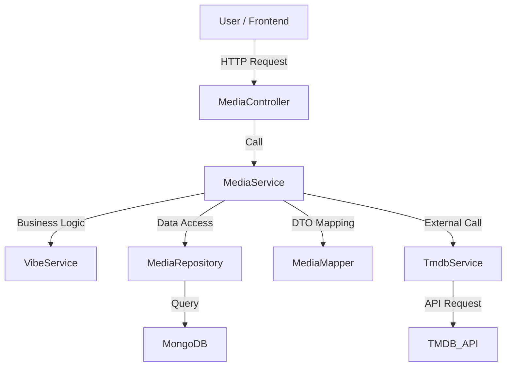

<!-- LOGO -->
<div align="center">
  
</div>


---

## 🗂️ Table of Contents
- [🎬 Introduction](#-introduction)
- [👉 Live Demo](#-live-demo)
- [🎯 Key Features](#-key-features)
- [🏛️ Architecture](#️-architecture)
- [🧰 Technologies & Tools](#-technologies--tools)
- [📂 Project Structure](#-project-structure)
- [🚀 How to Run the Application](#-how-to-run-the-application)
  - [📋 Requirements](#-requirements)
  - [📦 Initial Setup](#-initial-setup)
  - [🐳 Run with Docker (recommended)](#-run-with-docker-recommended)
  - [🧪 Run Locally (without Docker)](#-run-locally-without-docker)
- [📡 API Documentation (Swagger)](#-api-documentation-swagger)
- [📫 Postman Collection](#-postman-collection)
- [🧪 Tests](#-tests)
- [🤔 Challenges & Solutions](#-challenges--solutions)
- [📹 Video Demo](#-video-demo)
- [👥 Team](#-team)
- [🤝 Contribution](#-contribution)
- [📄 License](#-license)

---

## 🎬 Introduction
**Muvio** is a Java application that helps users find movies or TV series to watch based on their preferences, mood, release year, type, and other filters. Media content is loaded from the TMDB API and stored in a MongoDB database.

---

## 👉 Live Demo
The frontend part of the project is available at:
[Muvio Frontend](https://furart.github.io/Team_project_FE/#/)

---

## 🎯 Key Features
- **"Vibe" Search:** Unique filtering of media content by mood (`MAKE_ME_CHILL`, `SCARY_ME_SILLY`, etc.).
- **Advanced Filtering:** Ability to combine filters by release year, type (movie/series), and categories.
- **TMDB Synchronization:** Automatic loading and updating of movie and series data from The Movie Database (TMDB).
- **Pagination & Sorting:** Efficient loading of large data volumes.
- **Full Media Info:** Get detailed information about any movie or series by its ID.

---

## 🏛️ Architecture
The project uses a classic three-tier architecture. Data from the TMDB API and other sources is synchronized and stored in a MongoDB database.


---

## 🧰 Technologies & Tools
- **Language:** Java 21
- **Framework:** Spring Boot 3
- **Database:** MongoDB
- **Build:** Maven
- **Containerization:** Docker
- **Tools:** MapStruct, Lombok, JImageHash
- **API Documentation:** Swagger (OpenAPI)
- **Testing:** Mockito, JUnit 5
- **External API:** TMDB API

---

## 📂 Project Structure
The main application logic is located in `src/main/java/com/muvio`.
```
/src
├── main
│   ├── java/com/muvio
│   │   ├── controller      # REST controllers
│   │   ├── dto             # Data Transfer Objects
│   │   ├── exception       # Exception handlers
│   │   ├── mapper          # Mappers (MapStruct)
│   │   ├── model           # Data models (entities)
│   │   ├── repository      # Repositories (DB interaction)
│   │   ├── service         # Business logic
│   │   └── util            # Utilities
│   └── resources
│       ├── application.yml # Spring configuration
│       └── ...
└── test                    # Tests
```

---

## 🚀 How to Run the Application

### 📋 Requirements
- [Java 21](https://jdk.java.net/21/)
- [Maven 3.9+](https://maven.apache.org/install.html)
- [Docker](https://www.docker.com/products/docker-desktop) (for Docker run)
- Local instance of [MongoDB](https://www.mongodb.com/try/download/community) (for local run)

### 📦 Initial Setup
1.  Clone the repository:
    ```bash
    git clone https://github.com/backend-team-muvio/muvio.git
    cd muvio
    ```
2.  Create a `.env` file based on `.env.sample`.
3.  Fill in the environment variables in the `.env` file:
    ```env
    # Port for local run
    PORT=10000
    # Port mapped by Docker
    SPRING_LOCAL_PORT=8081
    # Port inside Docker container
    SPRING_DOCKER_PORT=8080
    # Debug port
    DEBUG_PORT=5005
    # MongoDB connection string
    MONGO_URL=your_mongodb_connection_string
    # TMDB API access token
    TMDB_API_TOKEN=your_tmdb_token_here
    ```
4.  **How to get TMDB API Token:**
  - Visit [TMDB API Settings](https://www.themoviedb.org/settings/api).
  - Register or log in.
  - Create an API key (type: Developer).
  - Copy the **API Read Access Token (v4 auth)** and paste it into `.env` as the value for `TMDB_API_TOKEN`.

### 🐳 Run with Docker (recommended)
This method will run the application and MongoDB database in Docker containers.

1. **Uncomment the mongoDB service in `docker-compose.yml`:**
   Open `docker-compose.yml` and uncomment the MongoDB service section to enable it.
   This will start a MongoDB instance with default credentials.
2. **Build the project:**
   Docker requires a built `.jar` file. Build it with Maven:
   ```bash
   mvn clean package
   ```
3. **Run:**
   ```bash
   docker-compose up --build
   ```
   The application will be available at `http://localhost:10000`.

### 🧪 Run Locally (without Docker)
This method requires a locally running MongoDB instance.

1.  Set `MONGO_URL` in the `.env` file to your local database connection string, for example:
    `MONGO_URL=mongodb://localhost:27017/muvio`
2.  **Run:**
    ```bash
    mvn clean spring-boot:run
    ```
    The application will be available at `http://localhost:8080`.

---

## 📡 API Documentation (Swagger)
The project uses Swagger (OpenAPI) for automatic generation of interactive API documentation. This is the best way to explore all available endpoints, their parameters, request bodies, and responses.

After starting the application, the full and always up-to-date documentation will be available at:

-   **When running locally:** [`http://localhost:10000/api/swagger-ui/index.html`](http://localhost:10000/api/swagger-ui/index.html)
-   **When running with Docker:** [`http://localhost:8080/api/swagger-ui/index.html`](http://localhost:8080/api/swagger-ui/index.html)

---

## 📫 Postman Collection
You can use our Postman collection to test the API.

1. Import the collection file, which can be found in the repository: `src/main/resources/postman/Muvio.postman_collection.json`.
2. Set up environment variables in Postman if needed (e.g., `base_url`).
3. Make API requests.

> **Note:** Before using the requests, make sure your local server is running.

---

## 🧪 Tests
The project has a high level of test coverage to ensure stability and reliability.

### Code Coverage
| Type     | Percentage |
|----------|------------|
| Lines    | 86%        |
| Branches | 59%        |
| Methods  | 89%        |
| Classes  | 92%        |

---

## 🤔 Challenges & Solutions
1.  **Task: Efficient "vibe" filtering.**
    -   **Challenge:** Creating logic that accurately reflects mood based on genres, keywords, and other media parameters.
    -   **Solution:** A system was developed where each "vibe" is associated with a set of criteria (e.g., `SCARY_ME_SILLY` = genres "Horror", "Thriller"). This allows flexible configuration and expansion of the selection logic.

2.  **Task: Synchronizing data with TMDB API.**
    -   **Challenge:** Avoiding data duplication and handling large volumes of information during synchronization.
    -   **Solution:** A mechanism was implemented to check for the presence of media in the database by unique TMDB ID before adding. Synchronization is performed in the background to avoid blocking the main functionality.

---

## 📹 Video Demo
- Watch the [Loom video](https://www.loom.com/share/218f533b4a56474b915b647662ce7fbb?sid=5c350dc3-235c-4b49-91a0-9c26ab2d152a) to see how the project works.

---

## 👥 Team
This project was developed by the `team-muvio`.

- **Oleksii Kolinko** - Java Developer ([LinkedIn](https://www.linkedin.com/in/oleksii-kolinko-3724272a6), [GitHub](https://github.com/OleksiiKolinko))
- **Vitalii Pavlyk** - Java Developer ([LinkedIn](https://www.linkedin.com/in/vitalii-pavlyk-82b5aa1a1/), [GitHub](https://github.com/4Vitalii5))

---

## 🤝 Contribution
We welcome any contributions to the project! If you want to add a new feature or fix a bug, please follow these steps:

1.  Fork the repository.
2.  Create a new branch for your feature (`git checkout -b feature/AmazingFeature`).
3.  Commit your changes (`git commit -m 'Add some AmazingFeature'`).
4.  Push to your branch (`git push origin feature/AmazingFeature`).
5.  Open a Pull Request.

Please make sure your code meets the project's quality standards and passes all tests.

---

## 📄 License
This project is licensed under the MIT License – see the [LICENSE](LICENSE) file for details.
